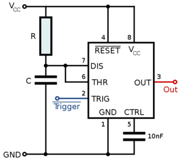

An electronic musical instrument
================================

The ultimate goal of the FPGA synthesizer work is to build a self-contained
electronic musical instrument. When I first started thinking about it at in my
twenties, I envisioned building it into a piece of PVC tubing four or five long
which would be held like a cello.

When I discovered that Sparkfun sells a somewhat novel sound transducer (one
large_ and one small_), I reconsidered the physical design to be something more
like a lute or guitar. Given the limits of my carpentry skills, I'm planning on
a tetrahedral body made of 1/4" plywood where one corner of the tetrahedron is
all right angles, to limit the number of strange angles I need to deal with.
It should be possible to cut out the plywood triangles easily on a laser cutter
at `danger!awesome`_. They now offer `DIY cutting`_ if you take a safety class,
which is potentially worthwhile.

The sounding hole (or on a lute, the rosette) will be a `Sierpinski triangle`_
design, scaled to be similar to the triangle forming the playing surface, and
situated symmetrically on that surface.

.. _`large`: https://www.sparkfun.com/products/10975
.. _`small`: https://www.sparkfun.com/products/10917
.. _`danger!awesome`: http://www.dangerawesome.co/
.. _`DIY cutting`: http://www.dangerawesome.co/2013/03/diy-lasering/
.. _`Sierpinski triangle`: http://en.wikipedia.org/wiki/Sierpinski_triangle

The touch-sensitive keyboard
----------------------------

In college I built a very cool touch-sensitive keyboard that scanned the keys
watching for the capacitance of the human body. I've since learned that I can
detect a light or heavy touch by seeing a smaller or larger capacitance, and it
is easily translated into a measurable pulse width. I'm planning on either a
three-octave 37-key keyboard or a four-octave 49-key keyboard. Each key is
connected to one pin of a CD4051_ analog multiplexer, and only one of the
CD4051s is enabled at a time, so each key is scanned individually. A short
low-going pulse is applied to the trigger input of a `555 timer IC`_ in
`monostable mode`_ and its threshold and discharge pins are tied to a pull-up resistor, and
routed through the CD4051 to one of the keys. When you touch the key, it
behaves like a capacitor to ground, increasing the output pulse width. The more
firmly you touch the key, the bigger the pulse width. The trigger pulse needs
to be shorter than the shortest expected RC time constant. Building the circuit
on a `solderless breadboard`_ with a 100K pull-up, I see a pulse width of 4
microseconds when not touching it, and about 12 microseconds when touching it
firmly. This indicates a parasitic capacitance on the breadboard of about 360
picofarads, and a total of about 1000 picofarads when touching firmly. I can
get a lower parasitic capacitance by replacing the breadboard with something
sparser. The touch capacitance will change a bit when protecting the copper key
with a layer of sealant_. I don't want the copper turning green after a few
months or years of playing. I'm going to need to physically mock up a key to
study realistic conditions, including putting on the sealant.

The time period is measured by a CPLD_ (which pulses the 555 and controls the
CD4051s), probably `this one`_ since it's powerful, affordable, and is already on
a breakout board. It has 256 macrocells so it can hang onto all the key codes
while scanning, and the RPi can fetch them later. (There has been `some FPGA
work`_ done with the Raspberry Pi.) Pulse widths can be encoded into just two or
three bits per key, and the RPi can notice how quickly the pulse width
increases, and convert that to a `MIDI key velocity`_.

The keyboard_ will be comprised of short lengths of 14-AWG solid bare copper
electrical wire running along the surface of the PVC in the pattern shown at
right. To make the case look as good as possible, I'll drill the holes for the
wire before I paint the PVC. Then put in the wires, then apply the sealant.

Monostable mode for the 555
---------------------------

Keyboard layout
---------------

.. image:: http://upload.wikimedia.org/wikipedia/en/0/0b/Wware-rotated-keyboard-small.png
   :alt: Keyboard layout

.. _`CD4051`: http://www.datasheetcatalog.org/datasheets/208/109138_DS.pdf
.. _`555 timer IC`: http://en.wikipedia.org/wiki/555_timer_IC
.. _`monostable mode`: http://en.wikipedia.org/wiki/555_timer_IC#Monostable
.. _`solderless breadboard`: http://en.wikipedia.org/wiki/Breadboard#Solderless_breadboard
.. _`sealant`: http://www.krylon.com/products/make_it_last_clear_sealer/
.. _`CPLD`: http://en.wikipedia.org/wiki/Complex_programmable_logic_device
.. _`this one`: http://www.digikey.com/product-detail/en/LC4256ZE-B-EVN/220-1146-ND/2641947
.. _`some FPGA work`: http://www.raspberrypi.org/phpBB3/viewtopic.php?t=9085&p=173976
.. _`MIDI key velocity`: http://www.blitter.com/~russtopia/MIDI/~jglatt/tech/midispec/noteon.htm
.. _`keyboard`: http://en.wikipedia.org/wiki/Musical_keyboard
